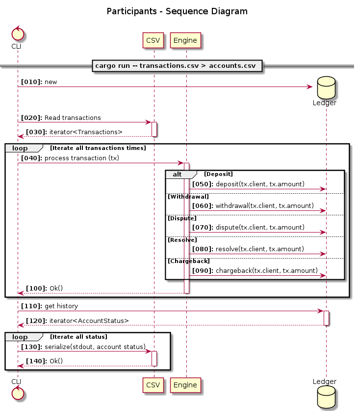

# Cthulhu - A super cool payment system

[](https://github.com/JoseRodrigues443/cthulhu/actions/workflows/ci.yaml)
[](https://github.com/JoseRodrigues443/cthulhu/actions/workflows/audit.yaml)

Why called Cthulhu? A mythical sea beast with multiple tentacles? Super cool of course...

Look at this thing!!! So awesome!!


A simple payments engine that reads a series of transactions from a CSV, updates client accounts, handles disputes and chargebacks, and then outputs the state of clients accounts as a CSV.

Feel free to see my profile at [joserodrigues443.github.io/](https://joserodrigues443.github.io/).

- [Cthulhu - A super cool payment system](#cthulhu---a-super-cool-payment-system)
  - [Install](#install)
  - [How to run](#how-to-run)
  - [Supported operations](#supported-operations)
    - [Example flow](#example-flow)
    - [Local Dev](#local-dev)
  - [Project structure](#project-structure)
  - [Next improvements](#next-improvements)

## Install

```bash

git clone git@github.com:JoseRodrigues443/cthulhu.git

```

## How to run

> Given a CSV representing a series of transactions, implement a simple toy transactions engine that processes the payments crediting and debiting accounts. After processing the complete set of payments output the client account balances You should be able to run your payments engine like

```bash

cargo run -- transactions.csv > accounts.csv

```

## Supported operations

- [x] Deposits
- [x] Withdrawals
- [x] Disputes
- [x] Resolutions
- [x] Charge backs


### Example flow

The following diagram can display then expected flow on the insertion of multiple transactions.




Expected input

|type   |client|tx |amount|
|-------|------|---|------|
|deposit| 1    | 1 | 1.0  |
|deposit| 2    | 2 | 2.0  |
|deposit| 1    | 3 | 2.0  |


Expected output

|client |available|held|total|locked|
|-------|---------|----|-----|------|
|1      |3.00     |0.00|3.00 |false |
|2      |2.00     |0.00|2.00 |false |


### Local Dev

```bash

# Build/install
make install-dev
make build

# Run with output to csv file and stdout
make dev

# Test
make test

# Bench
make bench

```

## Project structure

```bash

.
├── benches         # Benchmark tests directory
│   └── bench.rs
├── Cargo.lock
├── Cargo.toml
├── data            # Example data for run locally
│   ├── full
│   │   ├── output_example.csv
│   │   └── transactions.csv
│   ├── output_example.csv
│   └── transactions.csv
├── docs          # Documentation with Plantuml
│   └── uml
│       ├── flow.png
│       └── flow.puml
├── install.sh
├── LICENSE
├── Makefile
├── README.md
├── src
│   ├── args.rs         # Handles CLI arguments using crate `clap`
│   ├── constants.rs
│   ├── engine
│   │   ├── actions.rs
│   │   ├── core.rs
│   │   ├── database.rs
│   │   ├── mod.rs
│   │   └── registry.rs
│   ├── lib.rs
│   ├── main.rs
│   ├── read.rs         # Utility to read the CSV, supports IO, so extensible for other streams
│   └── transaction.rs
└── tests                     # Unitary tests
    ├── main-test.rs
    └── samples
        ├── 1_input.csv
        └── 1_output.csv

9 directories, 28 files

```

## Next improvements

- [ ] Improve the Store struct to allow for better data structures
  - [ ] InMemory
  - [ ] Dedicated databases
- [ ] Considering using async CSV (For example the crate `csv_async` uses `tokio`)
- [ ] A stronger battery of tests
- [ ] A stringer battery of bench tests


